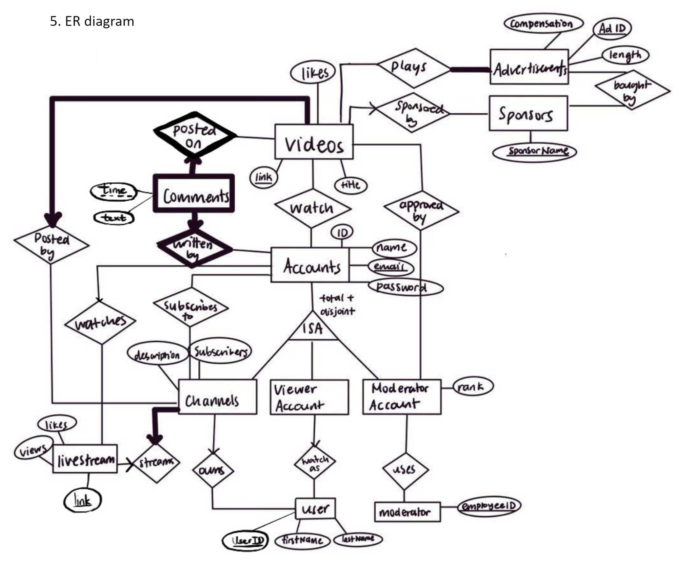

 # CPSC 304 Project Milestone 1
 - Milestone #: 1
 - Date: Feb 9 2024
 - Group Number: 30
 #### Group Member: 
 - Dennis Zhu, 47936935, v9l1a, dennis58@student.ubc.ca
 - Kathryn Wu, 19598275, t9o2s, kwu10@student.ubc.ca
 - Tina Yu, 23193998, w1c0r, tincantuna03@gmail.com

 - By typing our names and student numbers in the above table, we certify that the work in the attached assignment was performed solely by those whose names and student IDs are included above.  (In the case of Project Milestone 0, the main purpose of this page is for you to let us know your e-mail address, and then let us assign you to a TA for your project supervisor.)
   In addition, we indicate that we are fully aware of the rules and consequences of plagiarism, as set forth by the Department of Computer Science and the University of British Columbia

 ### Domain and model
 - a) The application’s domain is the management of a digital video platform, similar to some commonly used platforms, where users can have a role in both producing and watching the content. Accounts are split into three categories: viewing accounts, channels, moderator accounts. Viewing accounts are used for watching videos and leaving comments, channels can also post videos in addition to watching videos and leaving  comments. Advertisements may play with videos, or videos can be sponsored by an outside party. Channels can also broadcast live streams. Moderator accounts are used by the platform’s employees to monitor videos posted.

 - b) The database models the relationships between viewers, creators, their accounts, advertisements, sponsors, and videos as well as interactions with videos. Videos are watched through accounts. Viewers can also leave comments on videos through their accounts. For instance, if someone wanted to find a particular comment, they could look for the video and user account that made the comment. Videos are published on channels, a video-posting account owned by content creators. Videos can be sponsored by a sponsor, or have ads bought by a sponsor play alongside them. Additionally, there are moderators who monitor videos for inappropriate content. If a moderator found a video inappropriate, they could also immediately find the account and creator associated with it. 

 ### Database Specification

 - a) The database could be used for many things. For example, if a viewer liked a video, they could find the one channel associated with it and potentially subscribe to that channel. A moderator could also use the database to find which account posted a video, and contact them by email to inform them if the video is inappropriate. Sponsors who sponsor a video may want to look up the other videos of the creator whose video they are sponsoring has made. The search engine for the video platform could use the data in the database like the number of comments or people watching the video to generate the most popular result. 

 ### Application Platform

 - a) For the database of this project, we will use the department-provided Oracle database as our DBMS. 

 - b) For the technology stack of this project, we will use the Java Swing library for the user interface (GUI). We will also use the JUnit test for the testing of our project. For the API, we may use the JDBC API to connect the database and the application. We will use GitHub as our version control. For the IDE of this project, we will use IntelliJ IDEA for coding.

 ### ER diagram

 - 

 ###
